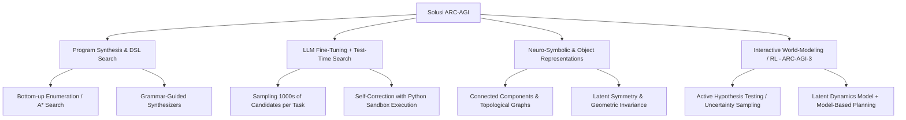

# Strategi Teknis & Tinjauan Pendekatan State-of-the-Art (ARC Prize 2026)

Dokumen ini mengulas arsitektur teknis mutakhir yang terbukti efektif untuk **ARC-AGI-2** (Penalaran Grid Statis) dan **ARC-AGI-3** (Penalaran Interaktif & Eksplorasi Agen).

---

## 🏛️ 1. Paradigma Utama dalam Pemecahan ARC

Secara umum, literatur dan solusi teratas ARC Prize terbagi dalam 4 paradigma utama:

---

## 🧩 2. Strategi untuk ARC-AGI-2 (Static Reasoning Track)

### A. Program Synthesis berbasis DSL (Domain-Specific Language)
- **Konsep:** Membangun bahasa pemrograman kecil (DSL) yang berisi primitif dasar (misal: `crop_object`, `rotate`, `find_connected_components`, `fill_enclosed_area`, `align_by_color`).
- **Pencarian:** Menggunakan algoritma pencarian (A*, Beam Search, atau Monte Carlo Tree Search) untuk merangkai primitif menjadi fungsi transformasi Python yang memetakan seluruh $X_{\text{train}} \to Y_{\text{train}}$ secara sempurna.
- **Kelebihan:** 100% konsisten, tidak ada halusinasi, dan sepenuhnya terverifikasi (*verifiable correctness*).

### B. LLM Code Generation dengan Test-Time Compute (Pendekatan Ryan Greenblatt / MindsAI)
- **Konsep:** Melatih atau mem-prompt LLM canggih untuk menulis program Python lengkap per tugas ARC.
- **Test-Time Search & Verification:**
  1. Generate puluhan hingga ribuan kandidat fungsi Python per task.
  2. Eksekusi setiap fungsi di sandbox pada seluruh pasangan input/output training.
  3. Saring hanya program yang lolos 100% pada training examples.
  4. Beri feedback pesan error/output mismatch ke LLM untuk iterasi perbaikan (*self-correction / reflexion loop*).
  5. Pilih program dengan kriteria konsistensi dan kesederhanaan (*Occam's Razor* / MDL) untuk menghasilkan output test.

### C. Object-Centric & Topological Graph Representation
- Manusia tidak melihat ARC sebagai matriks angka 2D $N \times M$, melainkan sebagai **objek-objek diskret** dengan properti (warna, bentuk, posisi relatif, kedalaman).
- Mengubah grid menjadi Graph (*Node* = Objek, *Edge* = Relasi spasial/kontak) dan memformulasikan solusi sebagai transformasi graf (*Graph Rewriting Rules*).

---

## 🎮 3. Strategi untuk ARC-AGI-3 (Interactive Reasoning Track)

ARC-AGI-3 memperkenalkan dimensi baru: **lingkungan interaktif dinamis dengan aturan tersembunyi**. Agen harus mengeksplorasi, memahami efek aksinya, dan menyelesaikan tujuan dengan efisiensi aksi tinggi.

### 4 Kemampuan Kunci yang Diuji di ARC-AGI-3:
1. **Active Exploration (Eksplorasi Aktif):** 
   - Memilih aksi yang memaksimalkan perolehan informasi (*Information Gain / Epistemic Curiosity*) daripada eksplorasi acak.
2. **Online World-Modeling (Pembentukan Model Dunia Real-time):**
   - Membangun transisi $s_{t+1} = f(s_t, a_t)$ dalam memori dinamis.
3. **Goal-Setting & Sub-goal Decomposition:**
   - Mengidentifikasi secara otonom kondisi menang/tujuan akhir berdasarkan perubahan reward atau state feedback.
4. **Fast Adaptation (Adaptasi Cepat):**
   - Menyesuaikan model kausal segera setelah aturan atau hukum fisika lingkungan baru ditemukan.

### Arsitektur yang Direkomendasikan untuk ARC-AGI-3:
- **Model-Based Reinforcement Learning / Planning (seperti MuZero / DreamerV3):** Agen memisahkan proses pembuatan representasi dunia dengan pencarian aksi berbasis simulasi internal.
- **Active Hypothesis-Testing Agent:** Menggunakan LLM/Program Generator untuk merumuskan hipotesis aturan ("Aksi 'Right' memindahkan balok merah"), melakukan aksi uji coba di environment, memvalidasi hasil observasi, dan memperbarui basis pengetahuan.

---

## 💡 4. Formula Paper Bernilai Tinggi (Target Skor $\ge 4.5$)

Untuk merebut posisi pemenang di Paper Track, pastikan paper Anda memuat kombinasi berikut:

1. **Jelas dan Ringkas:** Menyampaikan ide esensial secara padat di bawah 1.500 kata.
2. **Kaya Visualisasi:** Diagram arsitektur, grafik perbandingan komputasi vs akurasi (*test-time scaling curve*), dan ilustrasi langkah demi langkah pada contoh grid nyata.
3. **Landasan Teoretis Kuat:** Mengaitkan solusi dengan teori kompresi (*Minimum Description Length*), penalaran kausal (*Causal Induction*), atau *Bayesian Program Learning*.
4. **Studi Ablasi Lengkap:** Membuktikan secara empiris bahwa setiap modul yang dirancang benar-benar berkontribusi terhadap performa.
5. **Diskusi Kegagalan yang Jujur:** Menganalisis *edge cases* di mana sistem gagal dan memberikan arah perbaikan masa depan.
